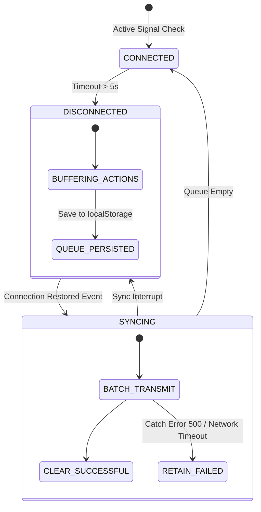

# Phase 10 System Specification: Distributed Intelligence Operating System (DIOS)

This document defines the edge synchronization state machine, transactional replication rules, and failover parameters of the VII Distributed Operating System.

---

## 1. Edge Synchronization State Machine

To survive in intermittent connectivity zones (Phase 1), client applications and local hubs run a localized edge sync loop, transitioning state dynamically based on network backhaul latency.



---

## 2. Low-Footprint Transactional Replication Schema

To prevent double-booking or state inconsistencies when replicating offline logs to the primary MongoDB cluster, DIOS utilizes transactional envelope wrappers:

```typescript
interface OfflineEnvelope<T> {
    transactionId: string;       // Unique UUID generated locally
    clientTimestamp: number;     // Ephemeral clock timestamp
    signature: string;           // Cryptographic hash of action properties
    payload: T;                  // Target model matching shared/src/types.ts
    syncAttempts: number;        // Tracking retry counts
}
```

### 2.1 Synchronization Integrity Rules
- **Idempotency Check**: The backend checks `transactionId` against a MongoDB unique index before committing, silently discarding duplicated sync packets.
- **Queue Protection**: If individual items within the batch sync fail (e.g., a ticket is rejected due to credit limits), the sync engine (`offlineService.ts`) extracts the failed envelope, clears only the completed envelopes from `localStorage`, and keeps the failed envelope in the queue for user correction.

---

## 3. Failover Coordination Matching Bounds

When central APIs are unreachable, edge devices fallback to autonomous local heuristics:

- **Local Booking Loop**: The passenger client compiles the reservation locally, sets `isOfflineSync: true` and generates a temporary ticket with a provisional QR payload.
- **Milestone Validation**: The driver's client app (`LogisticsApp.tsx`) scans the provisional QR, validating the ticket cryptographically offline using local secret keys. The ride start event is buffered on the driver's local queue until backhaul is restored.
- **Dynamic Pricing Failover**: Fares are calculated using the local happy-hour/rush-hour heuristic fallback (Phase 5), bypassing the server-side pricing engine.
- **Phase 1-9 Alignment**: By matching the coordinate projections (Phase 7) and agent contracts (Phase 6), the client maintains transaction validity entirely within the sandbox of local storage until backhaul availability triggers replication.
