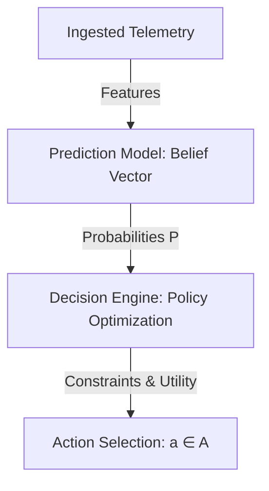

# Phase 11 Mathematical Specification: Mathematical Decision Engine (MDE)

This document formalizes the separation between probabilistic predictions and optimized actions, defining the objective utilities and constraint parameters of the MDE.

---

## 1. Differentiating Prediction from Action

A primary failure in standard AI systems is the conflation of probability predictions with decision policies (e.g., assuming high cancellation probability means the system must immediately reject the booking). The MDE enforces a mathematical boundary:

- **Prediction Space (\(\mathcal{P}\))**: Probabilistic beliefs generated by the reasoning layer (Phase 8), e.g., \(P(\text{Cancel} \mid d, h)\) or estimated crop decay rate \(t_{\text{decay}}\) (Phase 1).
- **Action Space (\(\mathcal{A}\))**: The finite set of executable choices, e.g., dispatching Tempo Rickshaw TP-1, routing passenger via Segment S-3, or applying peak multiplier \(M_s = 1.3\).

---

## 2. Dynamic Utility Objective Function

The MDE selects the action \(a^* \in \mathcal{A}\) that maximizes the Multi-Objective Utility Function:
\[
a^* = \arg\max_{a \in \mathcal{A}} \left[ w_f \cdot \text{Fare}(a) + w_r \cdot (1 - P(\text{Cancel} \mid a)) - w_d \cdot \text{DecayImpedance}(a) - w_c \cdot \text{TransitTime}(a) \right]
\]

where:
- \(\text{Fare}(a)\) is the transaction economic revenue calculated from the backend pricing API (Phase 5).
- \(P(\text{Cancel} \mid a)\) is the Bayesian cancellation probability estimated in Phase 8.
- \(\text{DecayImpedance}(a)\) is the crop shelf-life decay parameter calculated in Phase 1.
- \(\text{TransitTime}(a)\) is the travel latency computed via coordinate Bezier projections (Phase 7).
- \(w_f, w_r, w_d, w_c\) are system weight variables configured dynamically by the Panchayat or Admin panels.

---

## 3. Decision Constraint Verification

Before evaluating the utility function, the MDE filters out invalid actions using physical and database constraints:

1. **Cargo Load Bounds (Physical Boundary)**:
   \[
   W_{\text{cargo}} \le \text{Capacity}_{\text{max}}(v_i)
   \]
   where \(W_{\text{cargo}}\) is verified cargo mass (Phase 2), and \(v_i\) is vehicle payload capacity.
2. **Reputation Bounds (Trust Boundary)**:
   Discards matches if the edge trust score (Phase 9) drops below the safety threshold:
   \[
   \text{Reputation}(v_i) \ge R_{\text{min}}
   \]
3. **Offline Envelope Integrity (Sync Boundary)**:
   If operating on offline edge devices (Phase 10), the MDE restricts the Action Space to local storage actions, verifying signature envelopes before queue writeback.
