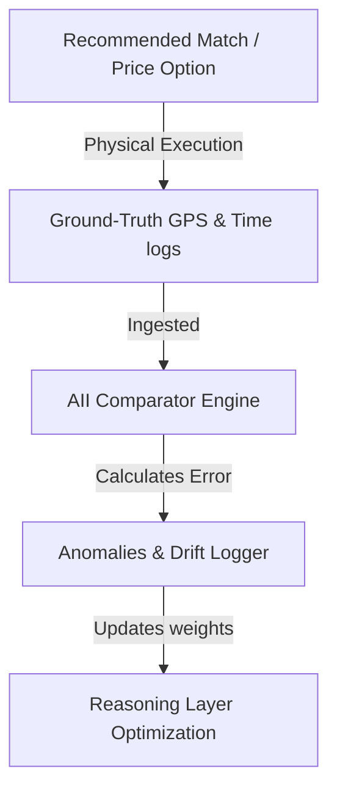

# Phase 12 System Specification: Adaptive Intelligence Infrastructure (AII)

This document defines the closed-loop learning loops, drift metrics, and automated recalibration alert triggers of the VII Adaptive Intelligence Infrastructure.

---

## 1. Closed-Loop Learning Feedback Loop

AII continuously validates the accuracy of the Cognitive Reasoning Engine (Phase 8) and MDE (Phase 11) decisions by comparing predictions against ground-truth physical telemetry logged via the Data Layer (Phase 2).



---

## 2. Prediction Drift Monitoring Parameters

AII computes system performance metrics over a rolling 24-hour window using Mean Absolute Error (MAE):

### 2.1 Spatial ETA Drift
For a set of \(N\) completed journeys, the ETA prediction error is:
\[
\text{MAE}_{\text{ETA}} = \frac{1}{N} \sum_{i=1}^{N} |t_{\text{actual}, i} - t_{\text{predicted}, i}|
\]
- **Drift Threshold**: If \(\text{MAE}_{\text{ETA}} > 15 \text{ minutes}\), the system flags an **ETA Drift Anomaly**.

### 2.2 Recommendation Acceptance Rate (RAR)
Traces the ratio of matching offers accepted by users (Phase 6):
\[
\text{RAR} = \frac{\text{Matches Accepted}}{\text{Matches Suggested}}
\]
- **Drift Threshold**: If \(\text{RAR} < 0.40\) (40% acceptance) over 100 consecutive suggestions, the system flags a **Market Coordination Mismatch Anomaly**.

---

## 3. Automated Recalibration & Alert Triggers

When system drift boundaries are breached, AII triggers self-healing failover alert workflows:

### 3.1 Recalibration Trigger Conditions
1. **Rule 1: Spatial Route Mismatch**: When GPS route deviations (Phase 4, 7) exceed 20% on a specific path, indicating road blocks or bad weather.
   - *Action*: Triggers a graph edge-weight recalculation in the Unified Knowledge Graph (Phase 9) for that segment.
2. **Rule 2: Unstable Pricing Loop**: When driver cancel rates (Phase 8) exceed 30% on a route despite peak surge multipliers (Phase 5).
   - *Action*: Triggers a pricing threshold warning to the Admin pricing board, prompting manual base fare adjustments.
3. **Rule 3: Offline Queue Sync Lag**: When sync processing times for offline envelopes (Phase 10) exceed 10 minutes.
   - *Action*: Triggers edge container thread throttle overrides, prioritizing transaction commits.

### 3.2 Notification Schema
When a trigger fires, the system creates a notification event logged in the Admin dashboard:
```json
{
  "triggerId": "AII-DRIFT-ETA-092",
  "anomalyType": "ETA_DRIFT",
  "metric": "MAE_ETA",
  "value": 18.2,
  "threshold": 15.0,
  "actionTaken": "Recalculated travelTimeMin weights on edge nodes for route Sasaram-Tilouthu. Alert sent to Admin panel.",
  "timestamp": 1773729715000
}
```
- **Phase 1-11 Alignment**: This feedback system ensures the mathematical decisions are constantly self-correcting, adapting to changing physical road and market realities without requiring code changes.
