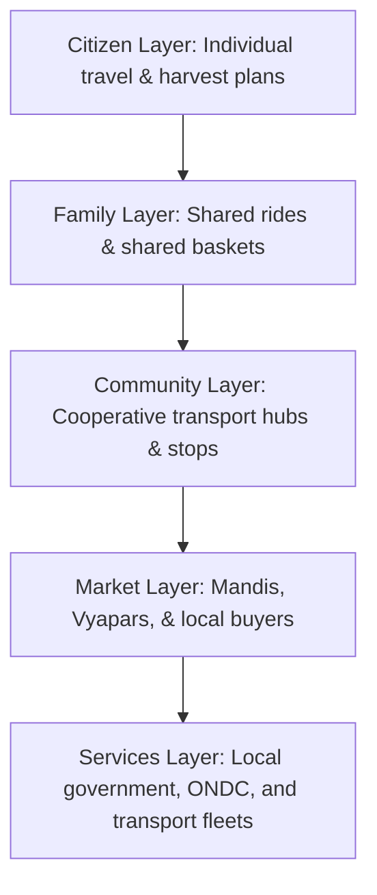

# Phase 13 System Specification: Collective Intelligence Protocol (CIP)

This document defines the hierarchical participation schemas, human-led consensus models, context-dependent reputation equations, and community memory archive structures of the VII.

---

## 1. Hierarchical Participation Schema

To coordinate sparse demand efficiently, the CIP organizes stakeholders into nested participation layers, aggregating coordination inputs upward:

---

## 2. Human-Led Consensus & Constraint Definition

Instead of relying on token voting or direct automated algorithms, CIP implements human-led consensus constraints:

- **Constraint Overrides**: Local Panchayats or Farmer Cooperatives configure binding constraints on the database (e.g., a maximum passenger fare cap on key routes, or priority allocations for smallholder farmers during harvest season).
- **Rule Boundary**: The Mathematical Decision Engine (Phase 11) treats these overrides as hard filters, rejecting matching options that violate community-configured constraints regardless of algorithmic utility scores.

---

## 3. Context-Dependent Reputation Equations

CIP rejects monolithic rating stars in favor of context-dependent reputation coefficients, isolating trustworthiness across specific domains:

### 3.1 Reputation Formulation
For a provider \(i\) in a specific context \(c\) (e.g., \(c = \text{"morning perishables transport"}\)), the reputation score \(R_{i, c}\) is:
\[
R_{i, c} = \alpha \cdot \text{QRVerifyRate}_{i, c} + \beta \cdot \text{OnTimeRate}_{i, c} - \gamma \cdot \text{DisputeRate}_{i, c}
\]
where:
- \(\text{QRVerifyRate}\) is the milestone scan compliance rate (Phase 2, 6).
- \(\text{OnTimeRate}\) is the schedule deviation score computed by the learning engine (Phase 12).
- \(\text{DisputeRate}\) is the ticket refund claim rate from the orders hub.
- \(\alpha, \beta, \gamma\) are context weights satisfying \(\alpha + \beta + \gamma = 1.0\).
- **System Impact**: A provider may have \(R = 0.95\) for crop logistics but only \(R = 0.40\) for passenger routing. This prevents localized failures from locking participants out of the entire platform.

---

## 4. Community Memory Archives

The CIP logs historical coordination outcomes in a localized, searchable graph database catalog (Phase 9):

- **Perishable Log**: Logs seasonal crop pricing and decay rates, adjusting the baseline shelf-life parameters of the reasoning layer (Phase 8).
- **Spatial Terrain Log**: Logs coordinates where route deviances occurred (Phase 7), identifying roads blocked during rainy seasons.
- **Incentive Ledger**: Measures collective achievements:
  - Total litres of diesel saved via ridesharing.
  - Net increase in farmer profit margins.
  - Verification logs are replicated across edge devices (Phase 10), ensuring community memory remains accessible during cloud outages.
