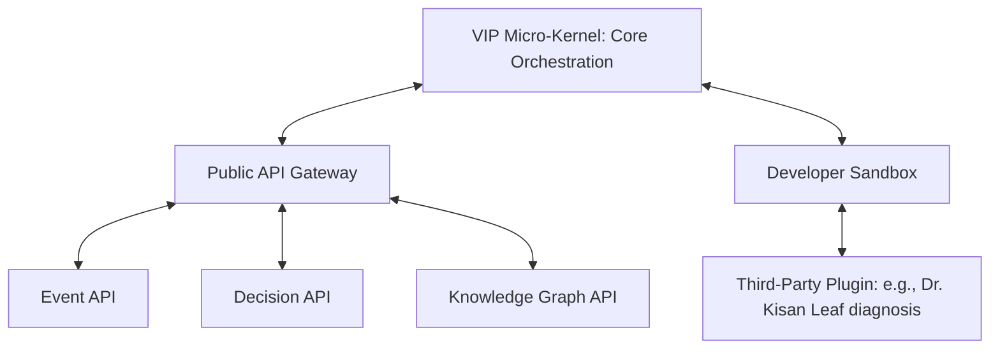

# Phase 15 System Specification: Village Intelligence Platform (VIP)

This document defines the platform kernel architecture, standardized event schemas, and plugin sandboxing verification pipelines of the VIP.

---

## 1. Modular Kernel-and-Plugin Architecture

The VIP operates as an extensible coordination micro-kernel. Third-party developers deploy modules (such as agricultural advisory or medical logistics) as sandboxed plugins interacting with the core engine via local APIs:



---

## 2. Standardized Event Model Schema

Every transaction, sensor output, and user booking inside the VIP must be broadcast as a signed, structured event envelope conforming to the event schema:

```typescript
export interface VIPEvent<T = Record<string, any>> {
    eventId: string;             // Unique event ID (UUID format)
    eventType: string;           // Namespace identifier, e.g., "yatra.booking.created"
    producerId: string;          // Origin client/device identifier
    timestamp: number;           // Ephemeral coordinate time
    location: {
        lat: number;
        lng: number;
    } | null;                    // Optional physical location context
    payload: T;                  // Event data payload matching shared/src/types.ts
    signature: string;           // Cryptographic sender signature protecting integrity
}
```

---

## 3. Plugin Verification Sandbox Pipelines

Before any third-party plugin is registered in the Unified Knowledge Graph (Phase 9) or executed in client applications, it must pass a three-stage validation pipeline:

### 3.1 Static Verification Scan
- **AST Security Check**: Scans source code AST (Abstract Syntax Tree) to ensure no imports of unauthorized packages (e.g., direct node network requests, direct filesystem mutations).
- **Type Compliance**: Verifies that input/output parameters map strictly to the models defined in the shared types catalog (Phase 2).

### 3.2 Dynamic Sandbox Testing
- **Execution Limits**: The plugin runs inside an isolated context (V8 VM sandbox) under strict resource parameters:
  - **CPU Timeout**: Maximum **100ms** per execution cycle.
  - **Memory Ceiling**: Maximum **50MB** RAM allocation.
- **Self-Healing Override**: If a plugin attempts to exceed resource thresholds, the platform kernel immediately terminates the execution thread, generates a container alert (Phase 12), and falls back to baseline defaults, preventing system crash (Phase 4).
