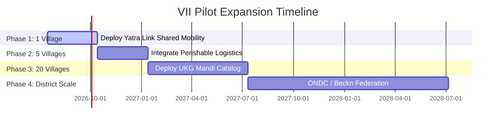

# Phase 16 System Specification: Execution Architecture & National Deployment Framework (EANDF)

This document formalizes the Technology Readiness Level (TRL) scale metrics, MVP feature limits, and pilot expansion timelines of the VII.

---

## 1. System Technology Readiness Level (TRL) Matrix

To evaluate component maturity and prioritize engineering tasks, VIP adopts the NASA/DOD TRL scale:

| Level | Definition | VII Core Components | Maturity Status |
| --- | --- | --- | --- |
| **TRL 1–3** | Basic research & mathematical modeling | Bayesian pricing, UKG schemas, MDE decision utility equations (Phases 7, 8, 9, 11). | **Completed (Docs)** |
| **TRL 4–5** | Lab simulation & component mockups | Autopilot 3D radar, simulated active ticket carousel, mock dynamic fare calculators. | **Completed (Code)** |
| **TRL 6–7** | Staging integration & field prototype | Offline synchronization queue (`offlineService.ts`), live pricing backend calculators (Phase 5, 10). | **Active Development** |
| **TRL 8** | Pre-production validation | Staged trial deployment in selected village node (Sasaram). | **Staging Phase** |
| **TRL 9** | National scale deployment | Monorepo deployment in production environments (Render, APK releases). | **Backlog** |

---

## 2. Stage 1 MVP Feature Bounds (Scope Control)

To prevent early complexity explosion (Phase 4, 15) and keep the codebase maintainable, the Stage 1 MVP is strictly locked to four core features:

1. **Passenger Booking**: Map route selector and destination select interface (`PassengerView.tsx`).
2. **Driver Matching**: Localized dispatch availability notifications (`DriverView.tsx`).
3. **Offline Queue**: Safe transaction buffering and signature logging (`offlineService.ts`), protecting state during signal timeouts.
4. **Milestone Verification**: Cryptographic QR-code check-ins (`LogisticsApp.tsx`) to verify passenger pick-up and drop-off physically.
- *Strict Exclusion*: No integration of blockchain tokens, metaverse simulations, or drone fleet scheduling in Stage 1.

---

## 3. Pilot Timeline & Expansion Roadmap

The pilot rollout proceeds incrementally to validate stakeholder reputation models (Phase 13) and pricing compliance (Phase 5):

### 3.1 Pilot Metrics Verification
At each phase boundary, the system must meet the **AII Drift Thresholds** (Phase 12):
- MAE of travel duration must remain under 15 minutes.
- Recommendation acceptance rate must stay above 40%.
- If these thresholds are not met, expansion halts, and the system enters recalibration.
