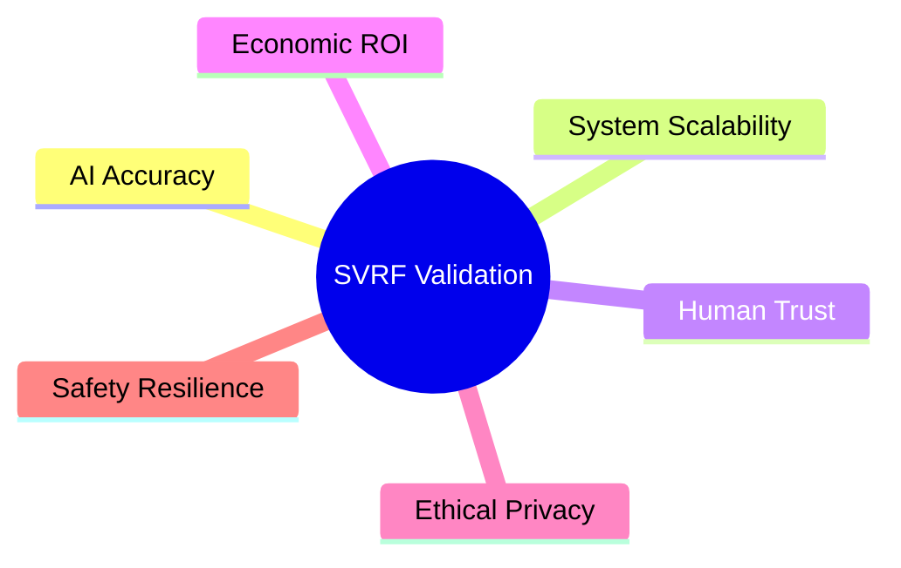

# Phase 17 Scientific Specification: Scientific Validation & Research Framework (SVRF)

This document formalizes the hypothesis testing parameters, sample size power calculations, validation matrices, and independent auditing protocols of the SVRF.

---

## 1. Hypothesis-Driven Development Framework

VII verifies system changes and matching optimizations using formal scientific hypotheses:

- **Hypothesis 1 (\(H_1\))**: Fusing NavIC coordinates with inertial sensors (Phase 14) reduces route tracking errors on canopy roads by at least 15% compared to raw GPS signals.
- **Hypothesis 2 (\(H_2\))**: Context-dependent reputation routing (Phase 13) increases collective trust, reducing passenger booking cancellation rates below 10%.
- **Hypothesis 3 (\(H_3\))**: Server-side Dynamic Pricing (Phase 5) combined with Bayesian cancellation prediction (Phase 8) increases local driver retention during peak agricultural harvest seasons.

---

## 2. Sample Size & Statistical Power Calculations

To guarantee that field trials yield statistically significant outcomes, sample sizes are computed using the two-tailed difference of means formula:

\[
n = \frac{2 \left( Z_{\alpha/2} + Z_{\beta} \right)^2 \sigma^2}{\delta^2}
\]
where:
- \(Z_{\alpha/2}\) is the significance threshold (e.g., \(1.96\) for a 95% confidence level, \(\alpha = 0.05\)).
- \(Z_{\beta}\) is the statistical power parameter (e.g., \(0.84\) for 80% power, \(\beta = 0.20\)).
- \(\sigma^2\) is the variance of travel delay times observed in historical village coordinates.
- \(\delta\) is the minimum detectable difference (e.g., a reduction in Coordination Latency by 10 minutes).
- **Execution Rule**: No pilot results are published unless the test dataset matches or exceeds the sample size constraint \(n\).

---

## 3. The Six Validation Vectors Matrix

| Vector | Target Metric | Verification Method |
| --- | --- | --- |
| **AI Accuracy** | \(\text{MAE}_{\text{ETA}} \le 15 \text{ mins}\) | Closed-loop AII comparator engine logging (Phase 12). |
| **System Scalability** | API Response Latency \(\le 100\text{ms}\) | V8 sandbox runtime memory profiling (Phase 15). |
| **Human Trust** | Client Reputation Score \(\ge 0.85\) | Milestone QR scan compliance log tracking (Phase 6, 13). |
| **Economic ROI** | Logistics Cost Reduction \(\ge 20\%\) | Comparing transaction pricing averages against baseline OLA. |
| **Ethical Privacy** | 100% Local data masking | Verifying no raw client PII leaves the offline envelope (Phase 10). |
| **Safety Resilience** | Fallback Activation Time \(\le 2.5\text{s}\) | Simulating GPS drops and verifying straight-line routing. |

---

## 4. Independent Auditing Protocol

To verify scientific claims, the framework exports a raw, cryptographic validation audit ledger containing:
- **Price Audit Records**: Ingested directly from backend MongoDB logs (Phase 5).
- **Explanation Reason Traces**: verifying the exact decision nodes triggered (Phase 8).
- **Envelopes Signature Chain**: proving transaction records were unmodified during offline buffering intervals (Phase 10).
