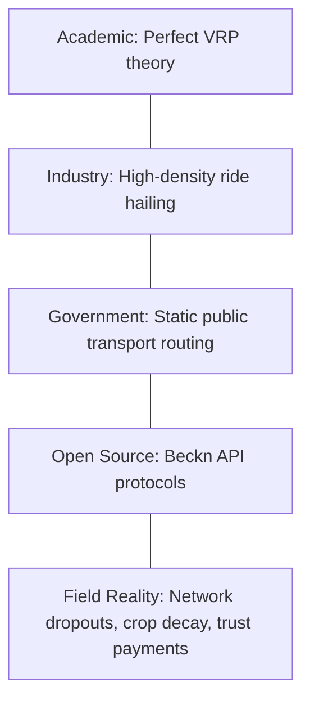

# Phase 19 System Specification: Research Gap Atlas (RGA)

This document formalizes the mapping of the five knowledge layers, gap matrix classifications, and patent probability scores of the RGA.

---

## 1. Mapping the Five Knowledge Layers

The VIP identifies coordination discrepancies by overlaying theoretical science against field operational constraints:

1. **Academic Layer**: Graph theory papers (Dijkstra/A*) assume stable topologies and infinite memory. They ignore the dynamics of intermittent edge nodes (Phase 10).
2. **Industry Layer**: Ride-hailing platforms (Uber, Ola) rely on centralized cloud services and continuous 4G/5G signal to maintain matching algorithms.
3. **Government Layer**: Public transport schedules are static, failing to adapt to dynamic demand spikes or agricultural harvest seasons.
4. **Open Source Layer**: Beckn and ONDC define standard transaction message schemas, but do not solve matching optimization problems (Phase 3).
5. **Field Reality**: Rural coordination operates under constraints of high network dropout, trust-based informal transactions (`UDHAAR`), and crop degradation risks (Phase 1).

---

## 2. Research Gap Category Matrix

We classify the operational challenges of the 12 Grand Challenges (Phase 18) into four distinct research gap types:

| Domain | Gap Category | Missing Subsystem | VII Resolution |
| --- | --- | --- | --- |
| **Mobility & Transit** | Engineering Gap | Offline synchronization queue | Safe local buffering envelopes (`offlineService.ts`). |
| **Agriculture Logistics** | Integration Gap | Linking shelf-life formulas to vehicle routing | Adding crop decay constraints to matching logic (Phase 2). |
| **P2P Matching** | Scientific Gap | Modeling consensus under trust constraints | Context-dependent reputation matrices (Phase 13). |
| **Open Commerce** | Integration Gap | Beckn message to optimization adapter | Binding API endpoints to server calculators (Phase 5). |

---

## 3. Subsystem Patent Probability Matrix

To secure the long-term intellectual property (MOAT) of the project (Phase 21), the RGA maps subsystems against novelty criteria:

### 3.1 Patent Mappings
1. **Fused Sensor Anti-Spoofing Filter (Phase 14)**:
   - *Description*: Algorithm detecting fake GPS routing based on velocity constraints.
   - *Patent Probability*: **High** (solves a distinct security problem using physical kinematics constraints).
2. **Context-Dependent Reputation Router (Phase 13)**:
   - *Description*: Edge weight modifier isolating driver reliability across domains.
   - *Patent Probability*: **Medium** (novel application of reputational graphs to transportation).
3. **Delay-Tolerant Transaction Envelope Sync (Phase 10)**:
   - *Description*: Queue processing protocol that preserves failed actions on browser storage.
   - *Patent Probability*: **Medium** (novel state-machine for edge client replication).
