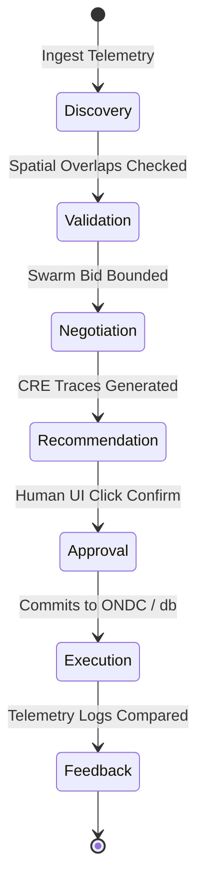

# Phase 23 System Specification: Universal Coordination Protocol (UCP)

This document formalizes the standardized Resource Object interface, Opportunity Object schema, and multi-stage lifecycle protocol pipelines of the UCP.

---

## 1. Standardized Resource Object Schema

Every physical asset (vehicle, cold storage, agricultural device) is represented as a standardized Resource Object, ensuring interoperability across all VIP modules (Phase 15):

```typescript
export interface ResourceObject {
    resourceId: string;                 // Unique global identifier (UUID)
    resourceType: 'VEHICLE' | 'STORAGE' | 'LABOR';
    ownerId: string;                    // Citizen node reference (Phase 9)
    capacity: {
        total: number;
        available: number;
        unit: 'KG' | 'SEATS' | 'LITRES';
    };
    spatialState: {
        coordinates: { lat: number; lng: number };
        headingDeg: number;
        speedKmh: number;
        lastUpdated: number;
    };
    dynamicConstraints: {
        minimumFare: number;            // Bounded from admin pricing setup (Phase 5)
        acceptedPayments: Array<'CASH' | 'ONLINE' | 'UDHAAR' | 'BARTER'>;
        engineStatus: 'OK' | 'WARNING' | 'CRITICAL'; // Telemetry check (Phase 14)
    };
    availabilityState: 'IDLE' | 'ALLOCATED' | 'OFFLINE';
}
```

---

## 2. Standardized Opportunity Object Schema

An Opportunity Object maps a potential transaction match between an idle Resource Object and a pending coordination request:

```typescript
export interface OpportunityObject {
    opportunityId: string;              // Unique match ID
    resourceId: string;                 // Matching ResourceObject reference
    demandId: string;                   // Matching Ticket/Order reference (Phase 2)
    matchScore: number;                 // Output utility from MDE (Phase 11)
    negotiatedTerms: {
        agreedFare: number;
        selectedPayment: 'CASH' | 'ONLINE' | 'UDHAAR' | 'BARTER';
        estimatedDurationSec: number;
    };
    validUntil: number;                 // Pre-arrival lock timeout (Phase 7)
    state: 'PROPOSED' | 'LOCKED' | 'EXPIRED' | 'CONFIRMED';
}
```

---

## 3. UCP Coordination Lifecycle Pipeline

The protocol coordinates assets using a deterministic 7-stage state transition pipeline:



1. **Discovery**: Nearby driver agents broadcast availability vectors (Phase 6, 7).
2. **Validation**: Enforces capacity, reputation, and crop decay constraints (Phase 1, 11).
3. **Negotiation**: Swarm agents bargain price increments bounded by dynamic pricing boundaries (Phase 5).
4. **Recommendation**: CRE generates trace justifications logged in database records (Phase 8).
5. **Approval**: Enforces human-in-the-loop confirmation overrides (Phase 4).
6. **Execution**: Syncs bookings to ONDC/Beckn gateways or buffers transactional envelopes locally if offline (Phase 10).
7. **Feedback**: AII measures ETA drift to recalibrate UKG graph edge weights (Phase 9, 12).
