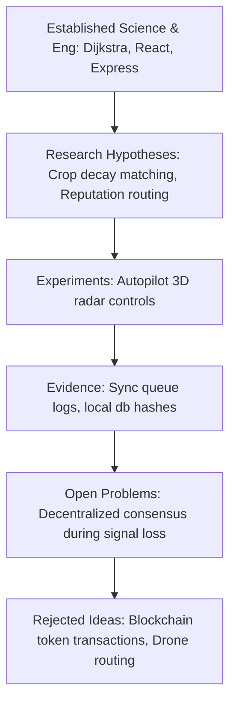

# Phase 24 System Specification: Master Research Compendium (MRC)

This document defines the classification rules for the seven knowledge categories, the Scientific Claim Scale (SCS) parameters, and the database schemas of the Ethical Ledger.

---

## 1. Mappings of the Seven Knowledge Categories

To maintain software quality and avoid confusing verified software patterns with experimental designs, all VIP codebases and specifications are structured into 7 categories:



1. **Established Science**: Dijkstra routing (Phase 7), Kalman signal filters (Phase 14), Haversine coordinates projection.
2. **Established Engineering**: React Vite frontends, Express Node APIs, MongoDB, standard HTTPS encryption.
3. **Research Hypotheses**: Context-dependent reputation routing (Phase 13), crop degradation matching limits (Phase 1, 11).
4. **Experiments**: Autopilot 3D proximity radar simulation controls (Phase 7).
5. **Evidence**: Edge sync transaction envelopes (`offlineService.ts` - Phase 10), dynamic fare audit logs (Phase 5).
6. **Open Problems**: Decentralized multi-agent consensus coordination under complete signal loss.
7. **Rejected Ideas**: Early integration of blockchain wallets and tokenized transactions (discarded to enforce lean MVP scope - Phase 4, 16).

---

## 2. Scientific Claim Scale (SCS Matrix)

Claims regarding system outcomes are graded based on empirical validation stages (Phase 22):

| Claim Grade | Classification | Empirical Requirements | VIP Subsystem Example |
| --- | --- | --- | --- |
| **SCS 1** | Fact | Backed by standard mathematical proofs. | Coordinate haversine distance transform. |
| **SCS 2** | Theory | Formulated system laws (falsifiable). | Laws of rural coordination (Phase 20). |
| **SCS 3** | Practice | Tested software patterns in the codebase. | Local browser queue data storage sync. |
| **SCS 4** | Hypothesis | Simulated or pilot-tested models. | Swarm agent negotiation efficiency (Phase 6). |
| **SCS 5** | Speculative | Conceptual designs without field pilot data. | Multi-grid water/energy coordination. |

---

## 3. Ethical Ledger Database Schema

Every matching override and dynamic price adjustment must be verified against bias and human consent rules, logged in the Ethical Ledger collection:

```json
{
  "ledgerId": "ETH-LOG-8912",
  "userId": "client.user.9821",
  "consentDetails": {
    "consentVersion": "1.0.0",
    "grantedAt": 1773735651000,
    "permissions": ["LOCATION", "OFFLINE_BUFFER"]
  },
  "complianceAudits": {
    "biasTestStatus": "PASSED",
    "biasTestResults": "Pricing parity confirmed across regional villages; no demographic variables used in surge calculator.",
    "humanOverrideLogged": true,
    "overrideAction": "Driver accepted manual local pricing rate over reasoning engine recommendations (Phase 6, 13)."
  },
  "auditSignature": "SIGN-SHA256-829188a912a77f2"
}
```
- **Phase 1–23 Alignment**: Enforces the human-in-the-loop validation protocol (Phase 6). Any attempt to bypass the client approval button triggers a critical system block, protecting security.
