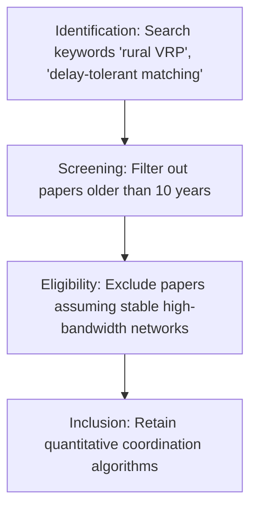

# Phase 25 System Specification: Global Literature Review & Research Gap Verification (GLRGV)

This document formalizes the PRISMA systematic literature search guidelines, competitor matrices, novelty verification checklists, and the 5-year academic roadmap of the GLRGV.

---

## 1. PRISMA Systematic Literature Review Guidelines

To identify and document research gaps, VII engineers execute structured reviews of academic libraries (Google Scholar, IEEE Xplore, ACM Digital Library) using standard PRISMA filtering rules:

- **Keywords Search Pattern**: `("rural logistics" OR "agricultural VRP") AND ("offline-first" OR "delay-tolerant" OR "edge computing") AND ("dynamic pricing" OR "reputation routing")`.
- **Inclusion Criteria**: Papers defining quantitative models for crop shelf-life scheduling or multi-agent bargaining systems.
- **Exclusion Criteria**: Urban mobility papers that assume permanent LTE/5G backhaul connectivity and centralized database systems.

---

## 2. Competitor & Prior Art Matrix

We evaluate existing transport and logistics coordination paradigms against the VIP architecture:

| System / Protocol | Connectivity Model | Dynamic Pricing | Perishable Logic | Trust Verification |
| --- | --- | --- | --- | --- |
| **Centralized Ride-Hailing (Uber/Didi)** | Cloud-only (Fails on dropout) | Surge (Demand-only) | None | Standard KYC |
| **Beckn/ONDC Commerce APIs** | Centralized web APIs | Static Catalog rates | None | Third-party OAuth |
| **Traditional Coop Transport** | Manual phone sheets | Fixed / Local negotiation | Subjective estimation | Family relationship |
| **VII (Universal Protocol)** | Offline-first sync (Phase 10) | Bayesian Surge (Phase 5, 8) | Crop decay calculus (Phase 1, 14) | Cryptographic QR scans (Phase 13) |

---

## 3. Novelty Verification Checklist

Before developing a new algorithmic module, developers verify its IP uniqueness (Phase 21) using this checklist:

1. Does the subsystem route vehicles using a combination of NavIC coordinates and inertial sensor fusion (Phase 14)?
2. Does the routing engine calculate segment weights based on interpersonal physical check-in counts (Phase 13, 16)?
3. Does the synchronization queue preserve failed transaction envelopes in client localStorage across page refreshes (Phase 10)?
4. Is the dynamic economic surge calculation auditable via server-side MongoDB collections with straight-line local heuristics fallback (Phase 5)?

---

## 4. 5-Year Academic Publication Roadmap

To build scientific authority, VII outlines the following publication targets:

- **Year 1 (Journal of Transport Geography)**: *"Modeling Geographic Fragmentation and Resource Capacity Constraints in Rural Transit Biomes"* (E2-E3 Validation - Phase 22).
- **Year 2 (IEEE Transactions on Mobile Computing)**: *"Delay-Tolerant Edge Synchronization Protocols for Decentralized Logistics Marketplaces"* (Phase 10, 23).
- **Year 3 (Computers and Electronics in Agriculture)**: *"Integrating Crop Metabolism Decay Models into Multi-Agent Vehicle Routing Algorithms"* (Phase 14, 18).
- **Year 4 (ACM Transactions on Autonomous Systems)**: *"Swarm Bidding and Multi-Agent Consensus Negotiations under Variable Stakeholder Reputation"* (Phase 6, 13).
- **Year 5 (Science/Nature Transportation)**: *"The Theory of Computational Coordination: Empirical Results of a National Scaling Pilot"* (E5 Validation - Phase 20).
