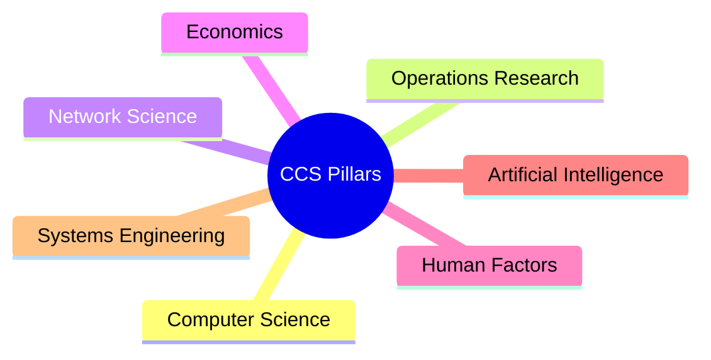

# Phase 26 Scientific Specification: Computational Coordination Science (CCS)

This document formalizes the atomic unit of coordination, the seven scientific pillars, optimization metric equations, and multi-layer stack architectures of CCS.

---

## 1. The Atomic "Coordination Event" Definition

In CCS, all rural coordination tasks are decomposed into discrete, immutable **Coordination Events** (\(E_c\)). This event serves as the fundamental ledger entry representing an allocation decision:

\[
E_c = \langle R_i, O_j, \vec{t}, S_{\text{network}}, W_{\text{rep}} \rangle
\]
where:
- \(R_i\) is the Resource Object representation mapping spatial availability (Phase 23).
- \(O_j\) is the Opportunity Object mapping demand constraints and pricing terms (Phase 23).
- \(\vec{t}\) is the spatiotemporal timestamp vector.
- \(S_{\text{network}}\) is the local edge connection state indicator (online, offline, degraded - Phase 10).
- \(W_{\text{rep}}\) is the dynamic reputation trust coefficient matrix (Phase 13).

---

## 2. The Seven Pillars of CCS

Computational Coordination Science is an interdisciplinary framework synthesizing seven established fields to solve rural fragmentation (Phase 19):



1. **Computer Science**: Offline-first local database replication, edge sync caching pipelines, and static VM sandboxes (Phase 10, 15).
2. **Operations Research (OR)**: Multi-objective vehicle routing optimizations (VRP) under crop degradation rates (Phase 1, 11).
3. **Network Science**: Spatiotemporal Cypher graphs modeling community transport structures and node hubs (Phase 9).
4. **Economics**: Living economic market dynamics, surge limits, and barter matching engines (Phase 5).
5. **Human Factors**: Manual human override gates, Panchayat consensus votes, and accessibility UI checks (Phase 4, 13).
6. **Artificial Intelligence (AI)**: Bayesian cancellation predictors, dynamic surge heuristics, and closed-loop recalibration (Phase 8, 12).
7. **Systems Engineering**: TRL matrix evaluation and validation testing plans (Phase 16, 17).

---

## 3. CCS Optimization Metrics

The performance of any VIP deployment is judged against three mathematical metrics:

### 3.1 Coordination Latency (\(\tau_c\))
The delay between demand generation and matching confirmation:
\[
\tau_c = t_{\text{confirmed}} - t_{\text{requested}}
\]

### 3.2 Opportunity Capture Rate (OCR)
The efficiency of match proposals in the field:
\[
\text{OCR} = \frac{\sum \text{Opportunities Confirmed}}{\sum \text{Opportunities Proposed}}
\]

### 3.3 Trust Retention Score (TRS)
The durability of community reputation systems:
\[
\text{TRS} = \frac{\sum \text{Milestone QR Checks Completed}}{\sum \text{Trips Executed}}
\]

---

## 4. Multi-Layer Coordination Stack

The VII architecture is structured into six functional abstraction layers:

```
+-------------------------------------------------------------+
| Layer 6: GOVERNANCE - Human override, reputation audits     |
+-------------------------------------------------------------+
| Layer 5: APPLICATION - Passenger & Driver View UI components|
+-------------------------------------------------------------+
| Layer 4: ALGORITHMIC - MDE, dynamic surge calculations      |
+-------------------------------------------------------------+
| Layer 3: KNOWLEDGE NETWORK - Cypher graphs, relational nodes|
+-------------------------------------------------------------+
| Layer 2: EDGE SYNC - Offline storage, buffered envelopes    |
+-------------------------------------------------------------+
| Layer 1: PHYSICAL - NavIC GPS sensors, cold storage vectors  |
+-------------------------------------------------------------+
```
