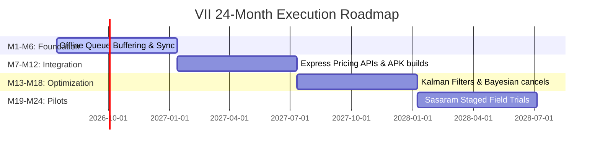
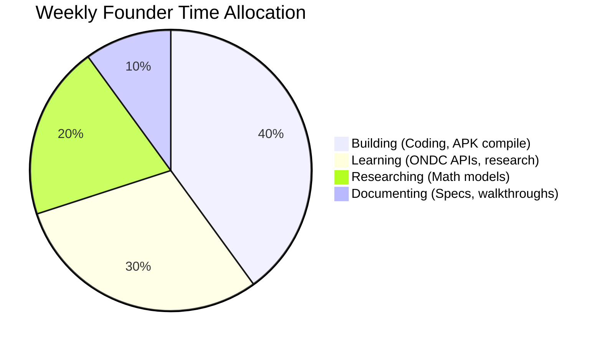

# Phase 28 System Specification: Execution Master Plan (EMP)

This document formalizes the 24-month developer roadmap timeline, MVP feature bounds, open-source reuse criteria, and weekly founder time allocation budgets of the EMP.

---

## 1. The 24-Month Developer Roadmap Timeline

To systematically transition research concepts (TRL 1–3) to production-scale regional deployments (TRL 8–9), VII engineers execute along a 4-phase timeline:

### 1.1 Development Milestones
- **M1–M6 (Foundation)**: Focus on local browser caching, TypeScript compiler hardening, and offline queue preservation (`offlineService.ts` - Phase 10).
- **M7–M12 (Backend/Mobile)**: Deploys MongoDB schemas, Express calculation routes (Phase 5), React portals for modal interfaces, and initial Android APK compiler runs.
- **M13–M18 (Optimization/AI)**: Integrates Kalman navigation filters (Phase 14), unified graph algorithms (Phase 9), Bayesian predictor loops (Phase 8), and adaptive learning recalibrations (Phase 12).
- **M19–M24 (Field Pilots)**: Deploys the Sasaram district pilot node, testing user adoption and measuring coordination metrics (Phase 16).

---

## 2. Strict MVP Feature Scope Bounds

To avoid engineering complexity explosion (Phase 4), all development sprints are restricted to four core feature bounds:

1. **Passenger Booking**: Simplified coordinates destination selector (`PassengerView.tsx`).
2. **Driver Matching**: Localized dispatch broadcasts and bid selectors (`DriverView.tsx`).
3. **Offline Queue**: Delay-tolerant transaction buffering envelope sync (`offlineService.ts` - Phase 10).
4. **Milestone Verification**: Cryptographic QR scan check-ins confirming passenger transitions (Phase 16, 23).
- **Strict Exclusion**: Early implementation of tokenized blockchain smart contracts, three-dimensional VR maps, or automated drone dispatch scheduling is prohibited.

---

## 3. Open-Source Reuse Criteria

To optimize engineering speed, the project relies on external modules under strict constraints:
- **Allowable Reuse**: Use standard mapping packages (Leaflet/Google Maps), UI components (React Portals, standard transitions), and cryptographic hashes (SHA-256 wrappers).
- **Prohibited Libraries**: Any framework requiring proprietary decentralized ledgers, Web3 wallet connectors, or heavy 3D rendering engines that breach browser memory caps (Phase 15).

---

## 4. Founder Weekly Time Allocation Budget

To ensure the founder stays close to code execution, time is allocated across a strict weekly budget:

- **40% Building**: Actively writing typescript modules, testing Express controller endpoints, and verifying build targets.
- **30% Learning**: Reading ONDC specs, analyzing competitor features, and evaluating field reports.
- **20% Researching**: Formulating mathematical models and solving network congestion laws (Phase 20, 26).
- **10% Documenting**: Logging transaction audits and maintaining project mapping logs (Phase 17, 24).
