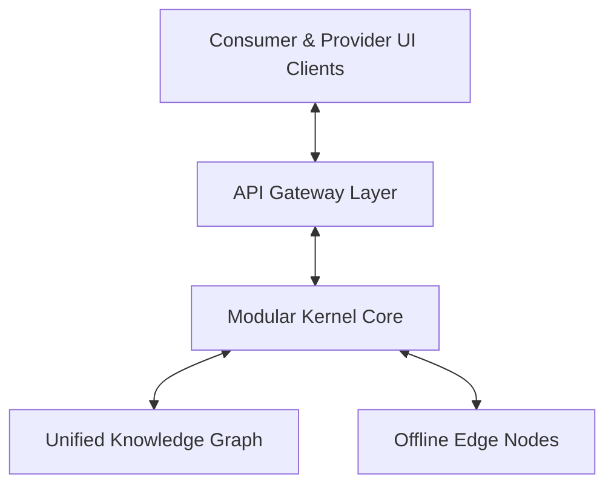
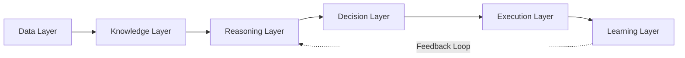

# Phase 2 System Architecture Specification: MIT System Design & DeepMind Engineering Spec

This document defines the system design, processing pipelines, and core layer interfaces of the Village Intelligence Infrastructure (VII).

---

## 1. Hierarchical System Architecture (MIT System Design)

The system is structured as a hierarchical state-control machine, separating real-time physical telemetry from high-level scheduling and booking optimizations.

### 1.1 Structural Isolation
- **Presentation State**: User coordinates, local booking requests, and chat logs are handled locally in React and Flutter components.
- **Kernel Core State**: Shared types defined in `shared/src/types.ts` act as the source of truth for contracts between frontend modules and the backend Express database services.

---

## 2. The Data-to-Learning Processing Pipeline (DeepMind Spec)

### 2.1 The Data Layer
- **Input**: Ingests raw telemetry and event telemetry (defined in `TelemetryData` interface in `types.ts`).
- **Telemetry Specifications**:
  - `speed`: Instantaneous vehicle speed in km/h.
  - `suspensionLoad`: Physical cargo mass in kg.
  - `batteryVoltage`: Voltage checks for electric vehicles.
  - `engineTemp`: Thermal state indicators.
- **Phase 1 Alignment**: Telemetry inputs capture raw physical limitations (e.g., if cargo mass exceeds capacity, the system triggers constraint alerts).

### 2.2 The Knowledge Layer
- **Ingestion**: Raw telemetry is mapped into the Unified Knowledge Graph as relational nodes.
- **Representation**:
  - **Nodes**: Farmers, Drivers, Vehicles, Warehouses, Crops, and Panchayats.
  - **Edges**: Travel times, trust logs, and crop transaction history.
- **Phase 1 Alignment**: By connecting the crop type to the transport schedule, the knowledge graph calculates the remaining shelf-life window.

### 2.3 The Reasoning Layer
- **Processing**: Evaluates dispatch and matching choices under uncertainty (weather, route delays, offline status).
- **Physics Calculation**: Incorporates the crop decay formula to filter matching logistics vehicles:
  \[
  t_{\text{elapsed}} + t_{\text{route}} < t_{\text{decay}}
  \]
- **Phase 1 Alignment**: Mitigates demand fragmentation by predicting vehicle return patterns and scheduling bookings ahead of time.

### 2.4 The Decision Layer
- **Formulation**: Outputs the optimal coordination recommendations (pricing, routing, and resource matching).
- **Constraints**: Applies admin base rates, surge pricing multipliers, and payment method validations (allowing cash, barter, and informal credit models like `UDHAAR`).
- **Human Authority**: Recommendations are sent as options to users (passengers or drivers). No action is executed without explicit human consent.

### 2.5 The Execution Layer
- **Action**: Converts accepted decisions into transaction and routing states.
- **Interoperability**: Connects to the Beckn protocol adapter (`becknAdapter.ts`) to dispatch orders to external local transportation and commerce providers (ONDC mobility networks).
- **Phase 1 Alignment**: Queues execution requests locally in the offline queue if cellular backhaul is down, preventing data loss.

### 2.6 The Learning Layer
- **Closed-Loop Feedback**: Monitors the difference between decision estimates and physical outcomes.
- **Metric**: Compares the estimated journey time against the actual telemetry speed match events:
  \[
  \text{Error} = t_{\text{actual}} - t_{\text{estimated}}
  \]
- **Recalibration**: Feeds accuracy drift back to the reasoning layer to recalculate search radii and booking windows for future dispatch runs.
