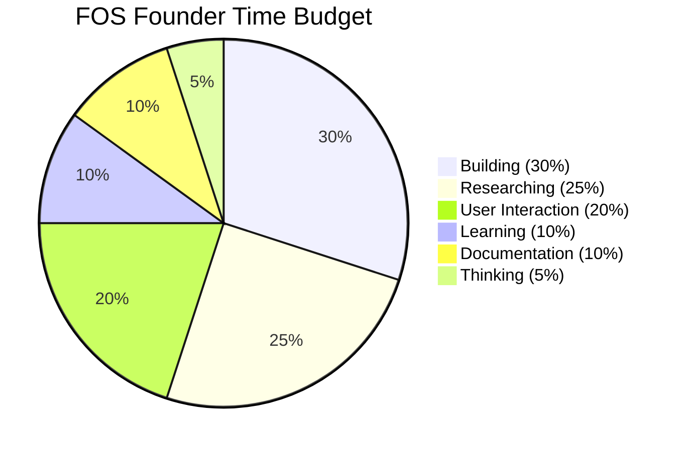

# Phase 30 System Specification: Founder Operating System (FOS)

This document formalizes the time transition allocation grids, database schemas for the three operational logs, legacy preservation rules, and the initial ten laws of the VII Constitution.

---

## 1. FOS Time Transition Grid

To maintain long-term alignment across product build phases and scientific research, the founder's weekly activities are structured into a 6-tier grid:



- **30% Building**: Writing code, testing Express middleware endpoints, compiling APK runtimes.
- **25% Researching**: Solving mathematical proofs, updating network routing equations (Phase 20, 26).
- **20% User Interaction**: Field tracking in pilot villages, driver feedback interview checks.
- **10% Learning**: Reading academic papers (PRISMA review targets - Phase 25), analyzing ONDC API protocols.
- **10% Documentation**: Maintaining compendiums, walkthroughs, and error logs (Phase 24).
- **5% Thinking**: Strategic design review, mapping security boundaries.

---

## 2. Notebook Schemas (Database Design)

The founder maintains three distinct ledger collections in MongoDB to prevent systemic knowledge loss:

### 2.1 Research Log
```json
{
  "logId": "RES-2026-07-16-01",
  "hypothesisTested": "NavIC inertial fusion prevents GPS drift",
  "mathematicalFormulation": "n = 2 * (Z_alpha + Z_beta)^2 * sigma^2 / delta^2",
  "resultConfidence": "E3",
  "timestamp": 1773737075000
}
```

### 2.2 Decision Log
```json
{
  "logId": "DEC-2026-07-16-02",
  "architectureChange": "Ported dynamic price calculations to server routing with client-side fallback heuristics",
  "reasoningJustification": "Restores pricing audit trails inside backend MongoDB while securing local offline checks",
  "approvedBy": "FOUNDER_SIGN_01",
  "timestamp": 1773737075000
}
```

### 2.3 Failure Log
```json
{
  "logId": "ERR-2026-07-16-03",
  "failureAnomaly": "V8 sandbox memory leak during swarm bid evaluation",
  "v8LimitBreach": "52MB RAM consumed (Sandbox Cap: 50MB)",
  "resolutionApplied": "Cleaned up event listener queue references inside plugin callback context",
  "timestamp": 1773737075000
}
```

---

## 3. Legacy Knowledge Preservation Rules

To protect the software if supporting corporate entities dissolve:
1. **Repository Preservation**: Core coordination engines, UCP definitions (Phase 23), and UKG database schemas (Phase 9) must be permanently maintained under public open-source licenses (MIT/GPL).
2. **Decentralized Execution**: The architecture must support local edge servers operated directly by village Panchayats or regional transport cooperatives (Phase 10).
3. **Open Standards Alignment**: The project must strictly reject proprietary integrations, ensuring all communication lines interface via public ONDC/Beckn schemas.

---

## 4. The VII Constitution: The First 10 Core Governance Laws

These fundamental governance laws are hardcoded as operational boundaries across all software modules:

1. **Offline Priority**: All core matches, bookings, and local ledger synchronization tasks must run independently of cloud backhaul connections (Phase 10).
2. **ONDC Compatibility**: The external data adapters must remain fully compatible with public ONDC/Beckn specifications (Phase 3).
3. **Explicit Human Override**: No multi-agent bidding sequence or dispatch recommendation may initiate financial transactions without human consent UI button confirmation (Phase 6).
4. **Surge Fare Caps**: Dynamic fare multipliers are capped by database configuration limits to prevent passenger exploitation (Phase 5).
5. **Unified Graph Schema**: All modules must share the central Cypher graph to prevent data fragmentation (Phase 9).
6. **Strict Sandbox Boundaries**: Deployed plugin modules must execute within locked V8 VM bounds (100ms CPU / 50MB RAM limit - Phase 15).
7. **Verifiable Reputation**: Citizen reputation scoring must be directly tied to physical check-ins and QR milestone verification (Phase 13, 16).
8. **Edge Privacy Preservation**: Raw customer PII data must remain masked inside offline edge bounds, preventing centralized database uploads.
9. **Falsifiable Iteration**: Optimization changes must undergo hypothesis-driven validation testing (Phase 17, 20).
10. **Legacy Access**: The core codebase remains permanently free and accessible to non-municipal regional communities.
