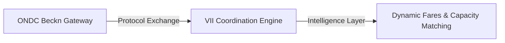

# Phase 3 Research Gap Mapping: Global Research Gap Mapping

This document maps the research and engineering gaps between existing commercial/public networks and the Village Intelligence Infrastructure (VII).

---

## 1. Mating Gaps in Commercial Mobility (Ola, Uber, Google Maps)

Commercial platforms are optimized for high-density, high-connectivity urban environments. They suffer from systemic failures when applied to rural coordination:

### 1.1 The Sparse Demand Failure
- **Commercial Model**: Assumes a continuous supply of drivers and passengers matching via real-time spatial proximity (search radius).
- **Rural Gap**: Due to fragmented demand (Phase 1), search radii must expand beyond 15 km. Traditional proximity algorithms decay in efficiency at this scale, leading to zero-match timeouts.
- **VII Approach**: Applies predictive multi-agent reservations (Phase 2) to match vehicles before they become idle, buffering reservations on a shared timeline.

### 1.2 Routing and Telemetry Limitations
- **Commercial Model**: Google Maps routing assumes continuous internet backhaul and standard municipal road classifications.
- **Rural Gap**: Does not incorporate physical infrastructure variables (e.g., bridge weight safety limits, rural block classifications, and real-time flood risk metrics).
- **VII Approach**: Integrates local spatial inputs directly into the offline-first router, bypassing standard highway routing in favor of verified village paths.

---

## 2. Gaps in Open Commerce Standards (ONDC / Beckn Protocol)

While ONDC and Beckn establish open standards for commerce and transit discovery, they define the protocol, not the intelligence:

### 2.1 The Execution-Optimization Gap
- **Protocol Boundary**: Beckn defines the APIs to query catalog items (`/search`) and confirm bookings (`/confirm`).
- **Research Gap**: Beckn does not resolve the optimization problem of *which* driver should serve the route, *how* cargo weight should be distributed to meet physical suspension load limits (Phase 2), or *what* dynamic fare rate maximizes driver earnings while keeping transit affordable.
- **VII Integration**: Acts as the intelligence layer behind the Beckn adapter (`becknAdapter.ts`), populating ONDC discovery schemas with optimal, constraint-aware options.

---

## 3. The Offline Operation Gap

- **Standard Platform**: Relies on a persistent server-client websocket connection. If connectivity drops, booking state and checkout processes are interrupted.
- **Research Gap**: Current systems lack a unified, delay-tolerant database synchronization engine that runs on the edge during cellular dropouts (Phase 1) and syncs transactional state (tickets, signatures) without duplication or data loss when connectivity is restored.
- **VII Approach**: Hardens the synchronization loop (`offlineService.ts`) to validate signatures and write back only failed transactions to `localStorage`, protecting state integrity.

---

## 4. Synthesis: The Uniqueness Moat

| Feature | Ola / Uber | ONDC / Beckn | VII Coordination Engine |
| --- | --- | --- | --- |
| **Primary Focus** | Urban transport | API Message standard | Rural multi-stakeholder matching |
| **Offline Resilience** | None (crashes on network drop) | Cloud-reliant exchange | Localized sync queue retry |
| **Physical Constraints** | Distance/Time only | Static catalog items | Dynamic cargo load & crop decay time |
| **Payment Options** | Cash / UPI online | Online / API gateway | Trust-aware (Barter, Udhaar, Escrow) |
