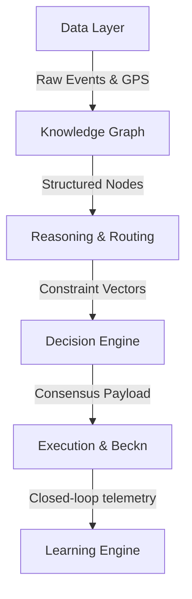

# Phase 4 System Philosophy & Architecture Foundation

This document defines the core philosophy, self-healing parameters, and structural layers of the Village Intelligence Infrastructure (VII).

---

## 1. The System-First Philosophy

VII is designed around a fundamental engineering principle: **The application is not a interface; it is an economic and physical coordination engine.**

### 1.1 Decoupling and State Separation
- **No Direct Mutation**: Presentation components (like `UserPanel.tsx` or `LogisticsApp.tsx`) never directly modify database states. All operations must proceed via verified transaction endpoints or local offline queues.
- **Contract Enforcement**: All entities must strictly conform to the shared TypeScript schemas in `shared/src/types.ts`. This ensures type safety across Vite bundles, Node backends, and Flutter clients.

---

## 2. Core Architectural Layer Boundaries

The system isolates execution steps into distinct processing boundaries to ensure high availability and prevent cascade failures:

### 2.1 API & Interface Boundaries
- **Telemetry Ingestion**: Ingests vehicle battery voltage, RPM, suspension load (cargo weight), and NavIC satellite strength into the Node.js backend.
- **Beckn Adapter Boundary**: Translates Beckn protocol requests (`/search`, `/select`, `/confirm`) into VII coordination recommendations via `becknAdapter.ts`.

---

## 3. Self-Healing & Deterministic Fallbacks

To ensure survival in unstable rural environments, VII implements explicit deterministic fallbacks when system bounds are breached:

### 3.1 Routing Latency Abort
- **Rule**: If a spatial query to the Google Maps Routing Service or local Dijkstra graph (`OfflineRouter.ts`) takes longer than **2.5 seconds**, the query aborts.
- **Fallback**: The system automatically switches to a **straight-line distance (haversine) calculation** fallback. This ensures booking checkout continues without leaving the user stranded.

### 3.2 Offline Queue Recovery
- **Rule**: If a batch sync in `offlineService.ts` fails due to intermittent cellular network timeouts.
- **Fallback**: Instead of dropping queued data, the handler halts the execution sequence, preserves only failed items in the `localStorage` queue, and logs a partial sync warning, retrying on the next browser `online` event.

### 3.3 Dynamic Fare Range Constraints
- **Rule**: If custom surge multipliers or peak-hour calculations in the reasoning layer generate values outside the limits set by the admin (`AdminPricingPanel.tsx`).
- **Fallback**: The decision layer forces pricing limits back inside the min/max fare bounds, preventing runaway pricing loops.
