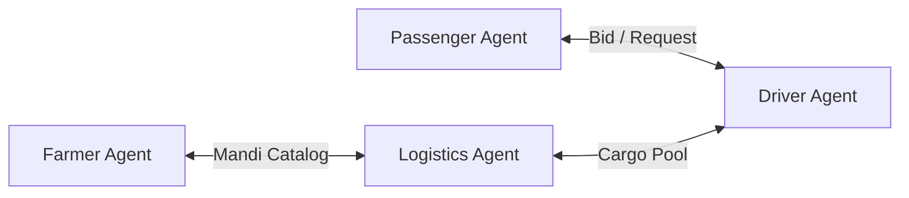

# Phase 6 System Specification: Multi-Agent AI Civilization

This document outlines the multi-agent framework, swarm negotiation rules, and safety boundaries of the Village Intelligence Infrastructure (VII).

---

## 1. Multi-Agent Framework

VII delegates operational decisions to a network of lightweight, autonomous, and cooperative AI agents, preventing the failure modes of single monolithic systems.

---

## 2. Defined Agent Roles & Interfaces

Agents operate as state machines utilizing the shared TypeScript schemas in `shared/src/types.ts` as their communication payload:

### 2.1 The Passenger Agent
- **Interface**: Interacts with the passenger view component (`PassengerView.tsx`).
- **Function**: Formulates travel desires (origin, destination), queries optimized paths, schedules pre-arrival bids, and queues local `BOOK_TICKET` events in the offline sync queue (`offlineService.ts`) during dropouts.

### 2.2 The Driver Agent
- **Interface**: Interacts with the driver view portal (`DriverView.tsx`).
- **Function**: Collects physical telemetry (instantaneous speed, battery voltage, suspension load), tracks seat config allocations (`SeatConfig` - SEAT or STANDING), and generates cryptographic verification QR payloads.

### 2.3 The Logistics Agent
- **Interface**: Interacts with the logistics portal (`LogisticsApp.tsx`).
- **Function**: Ingests crop decay limits (Phase 1) and parcel weight parameters (`weightKg`), automatically queries matching transit vehicles, and estimates delivery rates using the backend pricing calculator (Phase 5).

---

## 3. Swarm Negotiation Protocol

To solve the sparse demand and underutilization problems (Phase 1, 3), agents engage in swarm negotiation:

- **Bidding Range**: Bids are bounded on the lower end by the vehicle's operational minimum fare (`minimumFare`) and on the upper end by the capped peak surge pricing (`surgeMax`) defined in the database.
- **Negotiation Flow**:
  1. A Passenger/Farmer Agent broadcasts a route request.
  2. Nearby Driver Agents calculate available seat/cargo capacity.
  3. The system returns optimized bids utilizing the backend calculate API (Phase 5).
  4. The matching engine locks the reservation upon agreement.

---

## 4. Safety Boundaries & Human-in-the-Loop Override

Swarms negotiate coordinates and prices, but they operate under strict governance constraints:

- **No Autonomous Spending**: AI agents have **zero authority** to execute payment transfers (`UDHAAR`, `ONLINE`, `BARTER`) or charge wallets autonomously.
- **Explicit Human Consent**: The negotiation results are presented as options in the UI. The trip remains in a `PROVISIONAL` state until the passenger taps "Accept" and the driver taps "Accept & Navigate".
- **Physical Safety overrides**: If a sensor indicates vehicle suspension load limits are breached, the Driver Agent forces a capacity lockout, overriding any matching bids.
