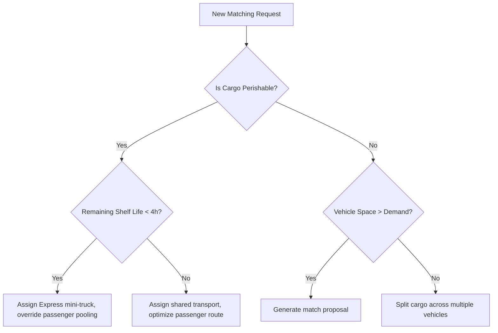

# Phase 8 System Specification: Cognitive Reasoning Engine (CRE)

This document defines the reasoning structures, decision tree matrices, and explainable logging protocols of the VII Cognitive Reasoning Engine.

---

## 1. Probabilistic Reasoning Under Uncertainty

To prevent the erratic outputs of direct LLM-to-action designs, the CRE enforces a strict separation: **AI models generate structured belief vectors, and deterministic engines compute the optimal decision options.**

---

## 2. Mathematical Decision Structures

### 2.1 Driver Cancellation Probability Model (Bayesian)
To optimize matching, the CRE calculates the probability of a driver cancellation given a suggested trip distance \(d\) and current time of day \(h\) using Bayesian inference:
\[
P(\text{Cancel} \mid d, h) = \frac{P(d, h \mid \text{Cancel}) \cdot P(\text{Cancel})}{P(d, h)}
\]
where:
- \(P(\text{Cancel})\) is the historical baseline cancellation rate.
- \(P(d, h \mid \text{Cancel})\) is the joint probability distribution of trip distances and hours for historically cancelled rides.
- \(P(d, h)\) is the probability distribution of incoming trip requests.
- **System Action**: If \(P(\text{Cancel} \mid d, h) > 0.40\), the matching engine routes the bid to alternative vehicles or adjusts pricing surge factors (Phase 5) to incentivize compliance.

### 2.2 Multi-Constraint Decision Tree
When a resource match query is triggered, the CRE evaluates matches using a hierarchical decision tree:



---

## 3. Explainable AI Logging Protocol

Every matching recommendation and price calculation must generate a traceable reason code.

### 3.1 Logging Structure
Reasons are logged alongside the transaction. In `PriceAudit` schema:
```json
{
  "auditId": "PA-AUTO-9821",
  "vehicleType": "AUTO",
  "appliedRates": { "surgeMultiplier": 1.3 },
  "reasoningTrace": {
    "demandFactor": 1.45,
    "activeDriversCount": 2,
    "pendingBidsCount": 5,
    "justification": "Peak demand surge applied due to high vehicle underutilization in Sasaram route (Active Drivers: 2, Pending Bids: 5)."
  }
}
```
- **Operational Traceability**: These logs are rendered in the Admin pricing panel audit log view, allowing administrators to inspect why the reasoning engine recommended specific surge overrides.
- **Phase 1-7 Alignment**: Helps resolve the trust constraints (Phase 1, 6) by showing passengers and drivers the exact mathematical basis behind fare changes and routing options.
