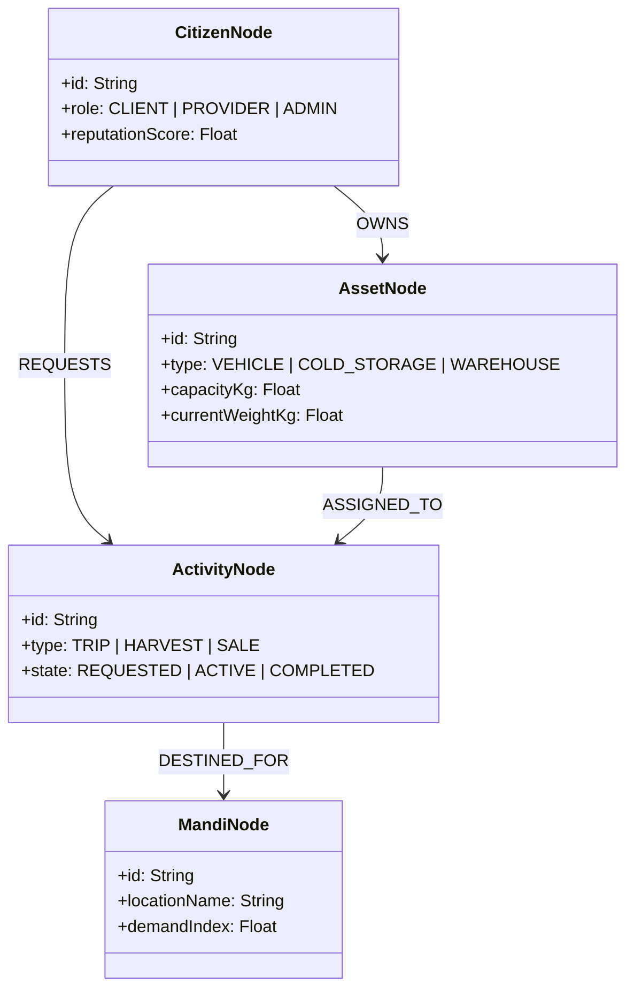

# Phase 9 System Specification: Unified Knowledge Graph Operating System (UKG-OS)

This document defines the node entities, dynamic edge properties, and sub-graph query structures of the VII Unified Knowledge Graph.

---

## 1. Unified Entity-Relationship Matrix

To prevent data silos and catalog fragmentation, VII structures all physical resources and activities as nodes within a single Unified Knowledge Graph.



---

## 2. Dynamic Edge Properties & Weights

Edges connecting entities store dynamic coefficients calculated by the digital twin (Phase 7) and cognitive engine (Phase 8):

### 2.1 Edge Weights Matrix
- **`trustScore`**: Bounded in \([0.0, 1.0]\), representing the historical reliability of a client-provider edge (e.g., driver QR boarding compliance rate).
- **`transitTimeMin`**: Dynamic value representing real-time traffic and road delays.
- **`decayImpedance`**: Temperature and humidity decay rate factor of perishable cargo along that segment (Phase 1).

---

## 3. Sub-graph Query Specifications

Below is the conceptual query representation matching a farmer's crop harvest event to an optimized local transport opportunity and buyer listing:

```cypher
// Matching harvest to transit vehicle headed to same destination Mandi
MATCH (farmer:Citizen {role: "CLIENT"})-[:PRODUCED]->(harvest:Activity {type: "HARVEST"})
MATCH (harvest)-[:REQUIRES_TRANSIT]->(cargo:Asset {type: "PERISHABLE"})
MATCH (driver:Citizen {role: "PROVIDER"})-[:OPERATES]->(vehicle:Asset {type: "VEHICLE"})
MATCH (vehicle)-[:TRAVELING_TO]->(mandi:MandiNode)
WHERE vehicle.capacityKg >= cargo.capacityKg
  AND (harvest.decayThresholdHours - vehicle.transitTimeHours) > 2.0
RETURN farmer.id, harvest.id, vehicle.id, driver.id, mandi.locationName
```

### 3.1 Resolving Constraints
- **Phase 1 Alignment**: The query automatically evaluates the remaining crop shelf life, filtering out vehicles that cannot complete the route within the decay threshold.
- **Phase 8 Alignment**: The CRE reads this sub-graph output, weighs it against Bayesian driver cancel risk, and serves the best matching bid proposal to both user clients.
